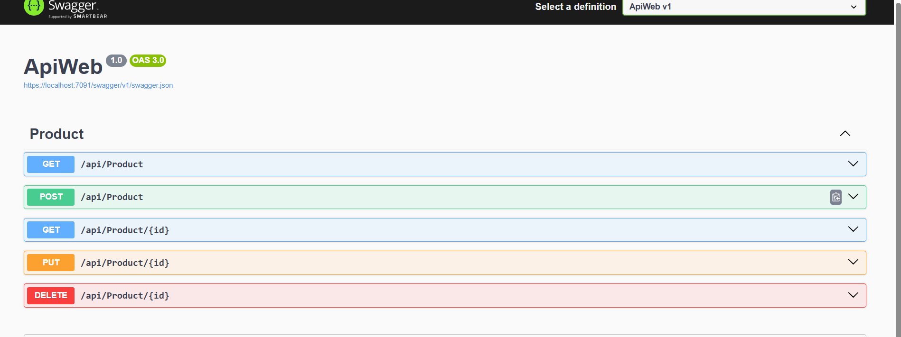
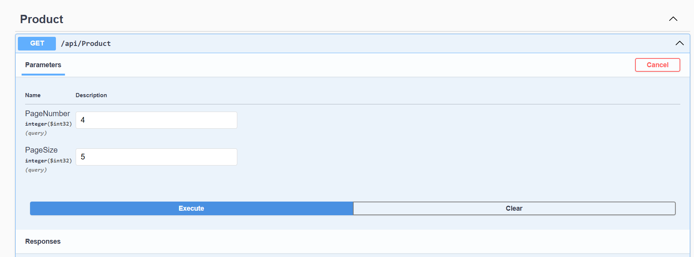
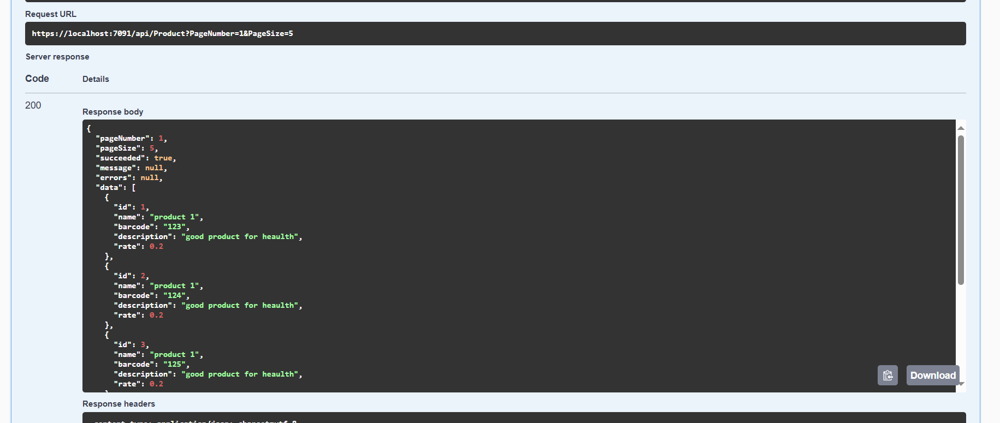

# Products.Store.Clean.Architecture

## Endpoints

---

## Get All Products with Pagination

The `GET /api/Product` endpoint supports pagination. You can retrieve a paginated list of products by providing the following query parameters:

- **PageNumber**: The page number to retrieve (default is 1).
- **PageSize**: The number of items per page (default is 10).

---

## Pagination Test
